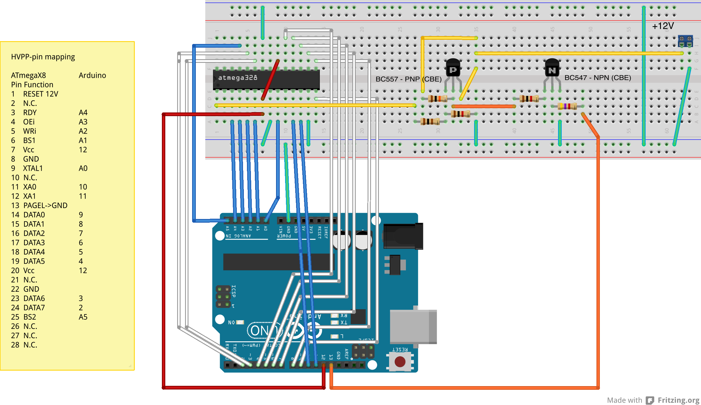

# RescueAVR

This sketch can be used to resurrect AVR chips with wrong fuse
settings using **high-voltage programming**. You need an Arduino, a breadboard, 2 transistors, a few
resistors and an external regulated 12 volt supply. In addition, the sketch is also an alternative firmware for
[manekinen's Fusebit Doctor](https://web.archive.org/web/20180225102717/http://mdiy.pl/atmega-fusebit-doctor-hvpp/?lang=en)

When you use the sketch, remember to set the baud rate to 19200 baud (no parity, 1 stop-bit).

### Using RescueAVR on an Arduino

I have tried out the sketch with an ATtiny84, an ATtiny85, and an
ATmega328 on the Arduino. I have included Fritzing wiring scheme for these three chips (see below). For other chips, you have to consult the data sheet of the particular micro-controller. 

The most important part for high-voltage programming is the ability to put 12 volt to the RESET pin of the MCU. So, you need a regulated 12 volt supply and a switch that applies this voltage to the RESET pin. Such a switch using two transistors is shown below. The transistors I have used are fairly standard ones. You can probably use any other reasonable type. But make sure that the pins are ordered as in the picture, i.e., CBE (otherwise the pins in the Fritzing diagram are not correct).

For small ATtinys, the wiring is straight forward because they use serial programming, where you need only few cables. A Fritzing diagram for an ATtinyX5 looks as follows.

Similarly, the wiring for an ATtinyX4 is quite simple as well. As you can see, one needs just 2 data lines (SDI, SDO), one clock line (SCI), one control libe (SII), and in addition one has to switch the RESET line and the Vcc line. 

For an ATmegaX8 MCU, the wiring is much more involved. Instead of 2 data lines, one clock line as well as three control lines (SII, RESET and Vcc), one has to deal with 8 data lines, one clock line, and 9 control lines! This may look like as in the following Fritzing diagram.

When this is put to work in reality, it can look as follows. Check the wiring twice before applying the external power. If 12 volt is applied to a pin that is not the RESET pin, the chip may easily die.

After you made all the connections (and double checked them!), open the Arduino monitor window, switch to 19200 baud, switch the external power supply on, and press reset on the Arduino. You are now in ***interactive rescue mode*** and can do a lot of things (see below).

### Using RescueAVR on the Fuse-Doctor

The Fuse-Doctor can be run stand-alone or connected to a computer. In the stand-alone mode, after power-up, all LEDs are off and you can insert
a chip. After pressing the button, the board will first try to
recognize the chip:

- green LED on for three seconds: chip has been successfully recognized,
- green LED on for one second, then red LED on for three seconds: chip has been rcognized, but there is not enough information in the firmware to resurrect it,
- red LED is on for three seconds: no chip recognized.

After having recognized the MCU, the board tries to reset all lock bits and then tries to set the fuses to a safe default setting. If successful, the green LED flashes for 5 seconds, otherwise the red LED flashes for 5 seonds. If unsuccessful, you can try to set the erase jumper, which allows for erasing the entire chip in order to recover it.

If the serial line on the board is connected to a computer using 19200 baud (no parity, 1 stop-bit) then you can use the ***interactive rescue mode***.

### Interactive Rescue Mode

When switched on or after a reset, the sketch will try to determine what kind of programming mode the MCU uses and which MCU is connected. If unsuccessful, the following is displayed:

	No chip found!
	Insert chip and reset or give details.

	Choose from:
  		P - HVPP
  		T - HVPP for Tiny
  		S - HVSP
  		R - Start again
	Choice: 

When this message is shown, you either forgot to insert the MCU, the wiring is wrong, the external power supply is not switched on, or the chip is badly damaged. In the latter case, you might try then to select the programming mode, where *HVPP* is the high-voltage parallel programming mode for ATmegas, *HVPP for Tiny* is the same mode for ATtinys (but PAGEL and BS1 are both controlled by BS1, and BS2 and XA1 are both controlled by BS2), *HVSP* is the high-voltage serial programming mode for ATtinys. You have to look up in the data sheet which mode is used for your MCU. After having selected a programming mode, you can try to set fuses and lock bits. However, I have never been successful when the MCU could not be identified anymore. In any case, it is more likely that there is a wiring error or you forgot to plug the MCU into the socket (or breadboard).

Usually, the chip is detected and something along the following line is printed.

	Signature: 1E910A
	MCU name:  ATtiny2313
	Current L/H/E-Fuses: 63 DF FF 
	Default L/H/E-Fuses: 62 DF FF 
	Current lock byte:   FF 
	Oscillator calibr.:  61 

You can then choose from the following menu.

	Choose:
  		T - Try to resurrect chip by all means
  		E - Erase chip
  		D - Burn default fuse values
  		L - Change low fuse
  		H - Change high fuse
  		X - Change extended fuse
  		K - Change lock byte
  		R - Restart
	Action: 
	
If you are only interested to unbrick your chip, press 'T'. This tries to unlock the chip. If this is not possible, it will try to erase the chip (if the 'chip erase' jumper on the Fuse-Doctor board is set). After it, it will try to reset the fuses to their default value. 

If 'T' does not help, you may have not set the 'chip erase' jumper on the Fuse-Doctor board. On the Arduino there is nothing like that, though. If even setting the jumper does not help, you can probably say 'good bye' to the chip. 

