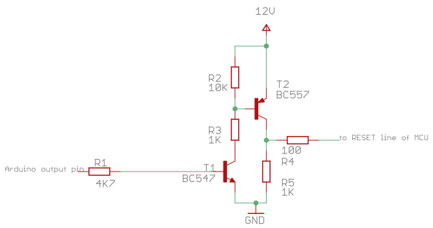
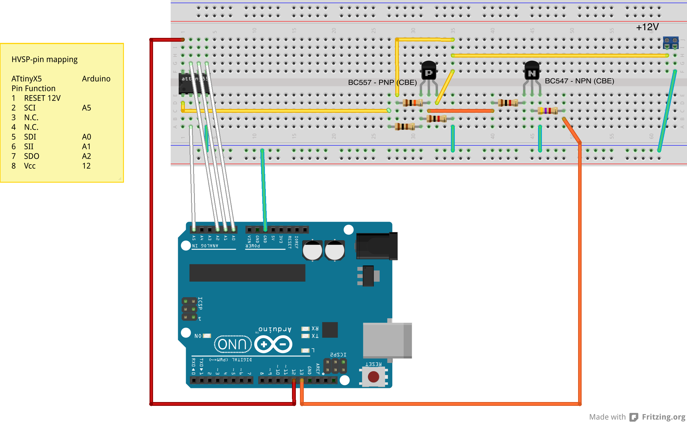
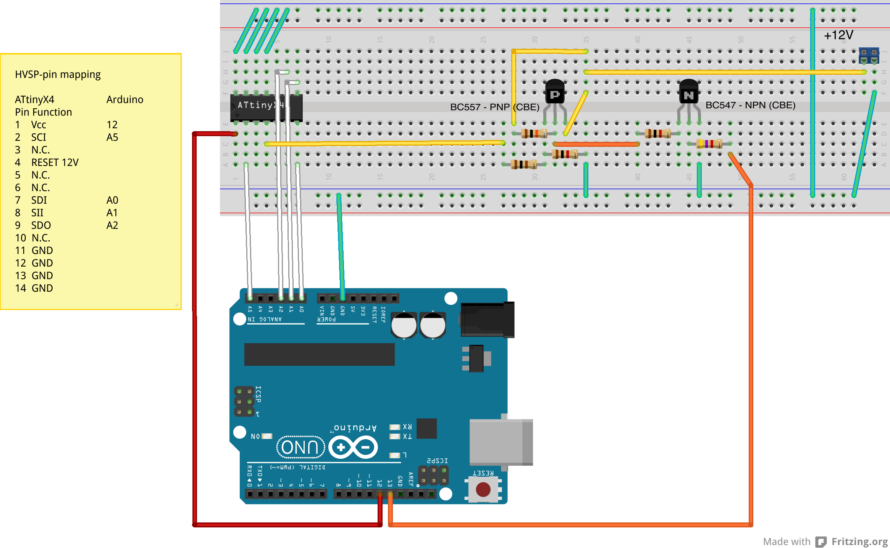
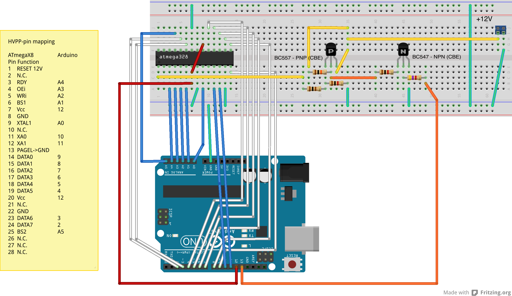
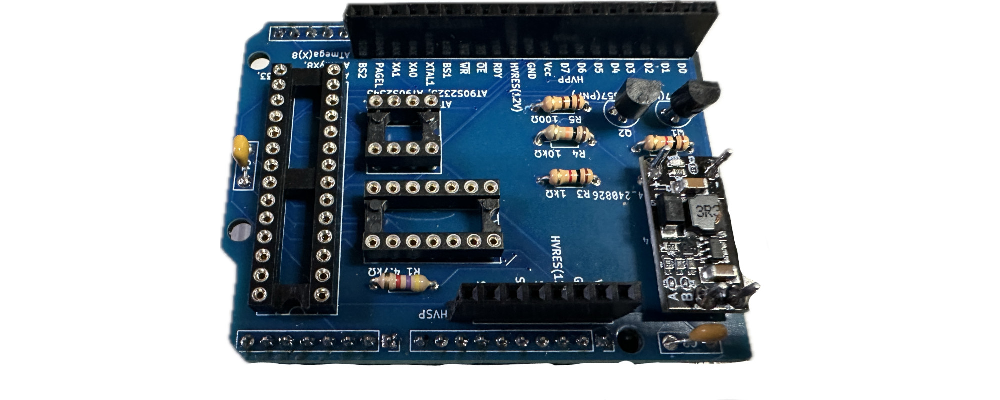
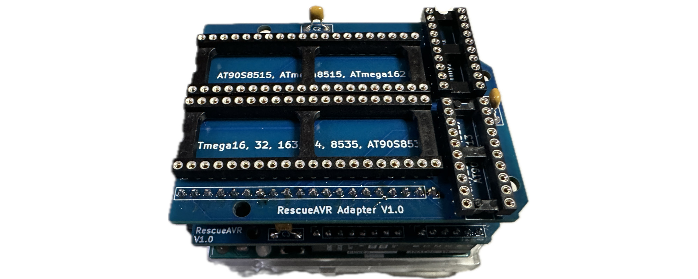

# RescueAVR Manual

The RescueAVR sketch can be used to rescue bricked AVR MCUs. You can run it on a UNO (or similar) with the target chip on a breadboard, or you can use it to drive the [RescueAVR shield (+ adapter board)](../pcb/), which [you can buy at Tindie](https://www.tindie.com/products/fogg/rescueavr-hv-fuse-programmer-for-avrs/). Finally, it can be used as an alternative firmware for the [Fusebit Doctor](https://web.archive.org/web/20180225102717/http://mdiy.pl/atmega-fusebit-doctor-hvpp/?lang=en).

One word of caution: Since the GPIO pins of two different MCUs will be directly connected to each other, you should upload the sketch __before__ connecting the target chip to the UNO board (or plugging in the RescueAVR shield). Otherwise, you risk short-circuiting a GPIO pin with an active high level to GND, which might destroy the chip.

Remember to set the monitor baud rate to 19200 baud (no parity, 1 stop-bit) when you use the sketch.

### Using RescueAVR on an Arduino Uno with a Breadboard

Below, you will find Fritzing wiring schemes for an ATtiny85, an ATtiny84, and an ATmega328. The complete list of supported chips can be found in [Appendix A](#appendixa). For chips other than the ATtinyX5, ATtinyX4, and ATmega(X)8, you need to consult the particular microcontroller's datasheet. The pin mapping can be found in the Memory Programming Section of each data sheet. For some popular MCUs, I have included wiring instructions for the DIP/SOIC versions of the chips in [Appendix B](#appendixb).

The most crucial part of high-voltage programming is the ability to put 12 volts into the RESET pin of the MCU. So, you need a regulated 12-volt supply and an electronic switch that applies this voltage to the RESET pin. Such a switch using two transistors is shown below. The transistors I have used are pretty standard ones. You can use any other reasonable type. But make sure that the pins are ordered as in the picture, i.e., CBE (otherwise, the Fritzing diagram is incorrect).

The wiring is straightforward for small ATtinys because they use serial programming, and you need only a few wires. The Fritzing diagram for an ATtinyX5 looks as follows (and applies to ATtiny11, 12, 13, 22, and most other 8-pin MCUs).

Similarly, the wiring for an ATtinyX4 is quite simple as well. As you can see, one needs just 2 data lines (SDI, SDO), one clock line (SCI), and one control line (SII), and in addition, one has to switch the RESET line and the Vcc line. 

The wiring for an ATmegaX8 MCU is much more involved. One has to deal with 8 data lines, one clock line, and 9 control lines! This may look like the following Fritzing diagram.

When this is put to work in reality, it can look as follows. Check the wiring twice before applying the external power. If 12 volt is applied to a pin that is not the RESET pin, the chip may easily die.

After you have made all the connections (and double-checked them!), open the Arduino monitor window, switch to 19200 baud, switch on the external power supply, and press the reset button of the Arduino UNO. You are now in interactive rescue mode and can do many things (see below).

### Using RescueAVR with a RescueAVR Shield

The RescueAVR shield can be directly plugged into an Arduino UNO board. It has an onboard step-up converter, so you do not need an external voltage source for high-voltage programming. It provides two SIL sockets for HVPP and HVSP. In addition, it contains DIP sockets for the ATinyX5 series, the ATtinyX4 series, and the ATmega(X)8 series. 

For the ATtinyX6(1) series, the ATtiny(X)232 series, the ATmegaX3, X4, 8535, the ATmega162, 8515, and pin-compatible chips, one can use an adapter board that plugs into the HVPP/HSP pin sockets. 

Before you plug in the target chip, you should plug in the shield on the UNO. After connecting the UNO board to a PC, you will enter interactive rescue mode, as described below.

### Using RescueAVR on the Fusebit Doctor

The Fusebit Doctor can be run stand-alone or connected to a computer. In the stand-alone mode (no serial communication lines connected to a computer), after power-up, all LEDs are off, and you can insert a chip. After pressing the button, the board will first try to recognize the chip:

- The green LED is on for three seconds: chip has been successfully recognized,
- the green LED is on for one second, and then the red LED is on for three seconds: The chip has been recognized, but there is not enough information in the firmware to resurrect it,
- the red LED is on for three seconds: no chip has been recognized.

After recognizing the MCU, the board checks whether any lock bits are set. If this is not the case, it tries to set the fuses to a safe default setting. If successful, the green LED flashes for 5 seconds; otherwise, the red LED flashes for 5 seconds. If unsuccessful, you can try to set the erase jumper, which allows for erasing the entire chip (including the lock bits) in order to recover it.

If the board's serial line is connected to a computer using 19200 baud (no parity, 1 stop-bit), you can use the ***interactive rescue mode***, which gives you more control than the stand-alone mode.

### Interactive Rescue Mode

To use RescueAVR in interactive mode, you should be connected to the Fusebit Doctor or Arduino by a serial line with 19200 baud, 1 stop bit, and no parity. This can be accomplished using the Arduino monitor window or any serial line client (e.g., cu, screen, or PuTTY). 

When switched on or after a reset, the sketch will try to determine what kind of programming mode the MCU uses and which MCU is connected. If unsuccessful, the following is displayed:

	No chip found!
	Insert chip and restart or give details.
	
	Choose from:
		P - HVPP
		T - HVPP for Tiny
		S - HVSP
		1 - HVSP for Tiny15
		R - Start again
	Choice: 

When this message is shown, you either forget to insert the MCU, the wiring is wrong, the external power supply is not switched on, or the chip is badly damaged. In the latter case, you might try then to select the programming mode, where *HVPP* is the high-voltage *parallel* programming mode for ATmegas, *HVPP for Tiny* is the same mode for ATtinys (PAGEL and BS1 are both controlled by BS1, and BS2 and XA1 are both controlled by BS2, so PAGEL and XA1 should not be connected to the chip). *HVSP* is the high-voltage *serial* programming mode for ATtinyX4(1) and 8-pin chips, *HVSP for Tiny15* is the serial mode for the ATtiny15. After selecting a programming mode, you can set fuses and lock bits. However, I have never been successful when the MCU could not be identified anymore. In any case, there is more likely a wiring error, or you forgot to plug the MCU into the socket (or breadboard).

Usually, the chip is detected, and something along the following lines is printed.

	Signature: 1E910A
	MCU name:  ATtiny2313
	HV type:   HVPP for Tiny
	Current L/H/E-Fuses: 63 DF FF 
	Default L/H/E-Fuses: 62 DF FF 
	Current lock byte:   FF 
	Oscillator calibr.:  61 

You can then choose from the following menu.

	Choose:
		T - Try to resurrect chip by all means
		E - Erase chip
		D - Burn default fuse values
		L - Change low fuse
		H - Change high fuse
		X - Change extended fuse
		K - Change lock byte
		R - Restart
	Action: 

If you are only interested in unbricking your chip, press 'T'. This will check whether lock bits are set, and if so, it will try to erase the chip (if the 'chip erase' jumper on the Fuse-Doctor board is set). After that, it will try to reset the fuses to their default value. If 'T' does not help, you can say 'goodbye' to the chip. 

The other options are all self-explanatory. If you want to change individual fuses, you may wish to consult the online fuse calculator [AVR Fuse Calculator](https://www.engbedded.com/fusecalc/) by Mark Hämmerling or the chip datasheet. The same goes for the lock byte.

When using the Arduino monitor window, you can enter a new fuse value immediately after the command. For example, typing `L7F` will change the low fuse to 0x7F (if possible).

### Appendix A: Supported MCUs

The sketch works with all currently available *classic* AVR chips (i.e., mainly those that can be programmed using ISP) and a few obsolete ones. Here is the list of supported MCUs (currently 131). The **bold** ones can be programmed using the RescueAVR shield by plugging the chip with a DIP footprint into one of the shield IC sockets. I have tested the *italics* ones.

- AT90CAN32, AT90CAN64, AT90CAN128
- AT90PWM1, AT90PWM2B, AT90PWM3B
- AT90PWM2, AT90PWM3
- ATPWM216, ATPWM316
- ATPWM81
- ATUSB646/7, ATUSB1286/7
- ATUSB82, ATUSB162
- **AT90S1200,** ***AT90S2313***
- **AT90S2333, *AT90S4433***
- ***AT90S2323*, AT90S2343**
- **AT90S4434, *AT90S8535***
- ***AT90S8515***
- ___ATtiny11___
- ***ATtiny12*, ATtiny22**
- ***ATtiny13***
- ATtiny43U
- ***ATtiny2313***, ***ATtiny4313***
- ***ATtiny24***, ***ATtiny44***, ***ATtiny84***
- *ATtiny441*, ATtiny841
- *ATtiny15*, 
- ***ATtiny25*, *ATtiny45*, *ATtiny85*** 
- ***ATtiny2*6**
- ***ATtiny261*, *ATtiny461*, *ATtiny861***
- ATtiny87, ATtiny167
- **ATtiny28, *ATtiny48*, *ATtiny88***
- ATtiny828
- ATtiny1634
- ***ATmega8515***
- ***ATmega8535***
- ***ATmega8***, ATmega8HVA, ATmega8HVB
- **ATmega16**, ATmega16HVA, ATmega16HVB, ATmegaM1, ***ATmega32***, ATmega32C1, ATmega32HVB, ATmega64, ATmega64C1, ATmega64HEV2, ATmega64M1, ATmega128, ATmega128RFA1
- ATmega640, ATmega1280, ATmega1281, ATmega2560, ATmega2561
- **ATmega161**, ***ATmega162***
- ATmega103
- ***ATmega163***, **ATmega323**
- **ATmega164, ATmega164P, ATmega324, ATmega324P, ATmega644, ATmega644P**, ATmega644RFR2, **ATmega1284, *ATmega1284P*,** ATmega1284RFR2
- ATmega165, ATmega165P, ATmega325, ATmega325P, ATmega3250, ATmega3250P, ATmega645, ATmega645P, ATmega6450, ATmega6450P
- ATmega406
- ***ATmega48*, *ATmega48P*,** ATmega48PB, ***ATmega88***, ***ATmega88P***, ATmega88PB, ***ATmega168*, *ATmega168P*,** ATmega16PB, ***ATmega328***, ***ATmega328P***, ATmega328PB
- ATmega169, ATmega169P, ATmega329, ATmega329P, ATmega3290, ATmega329P, ATmega649, ATmega649P, ATmega6490, ATmega6490P
- ATmega8U2, ATmega16U2, ATmega32U2
- ATmega16U4, ATmega32U4

### Appendix B: Wiring tables for DIP/SOIC variants of some MCUs

The wiring tables below apply only to the SOIC/DIP versions of the respective MCU types. 

#### ATtiny11, 12, 13, 22, 25, 45, 85, AT90S2323, 2343 (HVSP)

| ATtiny pin | Function               | Arduino UNO pin name |
| ---------- | ---------------------- | -------------------- |
| 1          | !RESET(12V switchable) | (triggered by 13)    |
| 2          | SCI                    | A5                   |
| 3          |                        |                      |
| 4          | GND                    | GND                  |
| 5          | SDI                    | A0                   |
| 6          | SII                    | A1                   |
| 7          | SDO                    | A2                   |
| 8          | Vcc                    | 12                   |

#### ATtiny15 (HVSP for Tiny15)

| ATtiny pin | Function               | Arduino UNO pin name |
| ---------- | ---------------------- | -------------------- |
| 1          | !RESET(12V switchable) | (triggered by 13)    |
| 2          |                        |                      |
| 3          | SCI                    | A5                   |
| 4          | GND                    | GND                  |
| 5          | SDI                    | A0                   |
| 6          | SII                    | A1                   |
| 7          | SDO                    | A2                   |
| 8          | Vcc                    | 12                   |

#### ATtiny24, 44, 84, 441, 841 (HVSP)

| ATtiny pin | Function    | Arduino UNO pin name |
| ---------- | ----------- | -------------------- |
| 1          | Vcc         | 12                   |
| 2          | SCI         | A5                   |
| 3          |             |                      |
| 4          | !RESET(12V) | (triggered by 13)    |
| 5          |             |                      |
| 6          |             |                      |
| 7          | SDI         | A0                   |
| 8          | SII         | A1                   |
| 9          | SDO         | A2                   |
| 10         |             |                      |
| 11         | GND         |                      |
| 12         | GND         |                      |
| 13         | GND         |                      |
| 14         | GND         |                      |

#### ATtiny2313 and 4313, AT90S1200, 2313 (tiny HVPP)

| ATtiny Pin | Function                 | Arduino UNO pin name |
| ---------- | ------------------------ | -------------------- |
| 1          | !RESET  (12V switchable) | (triggered by 13)    |
| 2          |                          |                      |
| 3          | RDY                      | A4                   |
| 4          |                          |                      |
| 5          | XTAL1                    | A0                   |
| 6          | !OE                      | A3                   |
| 7          | !WR                      | A2                   |
| 8          | **BS1**/PAGEL            | A1                   |
| 9          | XA0                      | 10                   |
| 10         | GND                      | GND                  |
| 11         | XA1/**BS2**              | A5                   |
| 12         | DATA0                    | 9                    |
| 13         | DATA1                    | 8                    |
| 14         | DATA2                    | 7                    |
| 15         | DATA3                    | 6                    |
| 16         | DATA4                    | 5                    |
| 17         | DATA5                    | 4                    |
| 18         | DATA6                    | 3                    |
| 19         | DATA7                    | 2                    |
| 20         | Vcc (5V)                 | 12                   |

#### ATtiny26, ATtiny261, ATtiny461, ATtiny861 (tiny HVPP)

| ATtiny pin | Function      | Arduino pin name  |
| ---------- | ------------- | ----------------- |
| 1          | !WR           | A2                |
| 2          | XA0           | 10                |
| 3          | XA1/**BS2**   | A5                |
| 4          | PAGEL/**BS1** | A1                |
| 5          | Vcc(5V)       | 12                |
| 6          | GND           | GND               |
| 7          | XTAL1         | A0                |
| 8          | !OE           | A3                |
| 9          | RDY           | A4                |
| 10         | !RESET(12V)   | (triggered by 13) |
| 11         | DATA7         | 2                 |
| 12         | DATA6         | 3                 |
| 13         | DATA5         | 4                 |
| 14         | DATA4         | 5                 |
| 15         | Vcc(5V)       | 12                |
| 16         | GND           | GND               |
| 17         | DATA3         | 6                 |
| 18         | DATA2         | 7                 |
| 19         | DATA1         | 8                 |
| 20         | DATA0         | 9                 |

#### ATtiny87, ATtiny167 (tiny HVPP)

| ATtiny pin | Function      | Arduino UNO pin name |
| ---------- | ------------- | -------------------- |
| 1          | DATA0         | 9                    |
| 2          | DATA1         | 8                    |
| 3          | DATA2         | 7                    |
| 4          | DATA3         | 6                    |
| 5          | Vcc(5V)       | 12                   |
| 6          | GND           | GND                  |
| 7          | DATA4         | 5                    |
| 8          | DATA5         | 4                    |
| 9          | DATA6         | 3                    |
| 10         | DATA7         | 2                    |
| 11         |               |                      |
| 12         | RDY           | A4                   |
| 13         | !OE           | A3                   |
| 14         | XTAL1         | A0                   |
| 15         | Vcc(5V)       | 12                   |
| 16         | GND           | GND                  |
| 17         | PAGEL/**BS1** | A1                   |
| 18         | XA1/**BS2**   | A5                   |
| 19         | XA0           | 10                   |
| 20         | !WR           | A2                   |

#### ATtiny1634 (tiny HVPP)

| ATtiny pin | Function      | Arduino UNO pin name |
| ---------- | ------------- | -------------------- |
| 1          |               |                      |
| 2          | DATA7         | 2                    |
| 3          | DATA6         | 3                    |
| 4          | DATA5         | 4                    |
| 5          | DATA4         | 5                    |
| 6          | DATA3         | 6                    |
| 7          | DATA2         | 7                    |
| 8          | DATA1         | 8                    |
| 9          | DATA0         | 9                    |
| 10         | GND           | GND                  |
| 11         | Vcc(5V)       | 12                   |
| 12         | XTAL          | A0                   |
| 13         |               |                      |
| 14         |               |                      |
| 15         | !RESET(12V)   | (triggered by 13)    |
| 16         | !OE           | A3                   |
| 17         | !WR           | A2                   |
| 18         | **BS1**/PAGEL | A1                   |
| 19         | XA0           | 10                   |
| 20         | XA1/**BS2**   | A5                   |

#### ATtinyX8, ATmega8, ATmegaX8, AT90S2333, 4433 (HVPP)

| ATmega pin | Function             | Arduino UNO pin name |
| ---------- | -------------------- | -------------------- |
| 1          | !RESET(12V)          | (triggered by 13)    |
| 2          |                      |                      |
| 3          | RDY                  | A4                   |
| 4          | !OE                  | A3                   |
| 5          | !WR                  | A2                   |
| 6          | BS1                  | A1                   |
| 7          | Vcc                  | 12                   |
| 8          | GND                  | GND                  |
| 9          | XTAL1                | A0                   |
| 10         |                      |                      |
| 11         | XA0                  | 10                   |
| 12         | XA1                  | 11                   |
| 13         | PAGEL (not AT90SX33) | GND                  |
| 14         | DATA0                | 9                    |
| 15         | DATA1                | 8                    |
| 16         | DATA2                | 7                    |
| 17         | DATA3                | 6                    |
| 18         | DATA4                | 5                    |
| 19         | DATA5                | 4                    |
| 20         | Vcc                  | 12                   |
| 21         |                      |                      |
| 22         | GND                  | GND                  |
| 23         | DATA6                | 3                    |
| 24         | DATA7                | 2                    |
| 25         | BS2 (not AT90SX33)   | A5                   |
| 26         |                      |                      |
| 27         |                      |                      |
| 28         |                      |                      |

#### ATmega16, ATmega32, ATmegaX3, ATmegaX4,  ATmega8535, AT90S8535 (HVPP)

| ATmega pin | Function            | Arduino UNO pin name |
| ---------- | ------------------- | -------------------- |
| 1          | DATA0               | 9                    |
| 2          | DATA1               | 8                    |
| 3          | DATA2               | 7                    |
| 4          | DATA3               | 6                    |
| 5          | DATA4               | 5                    |
| 6          | DATA5               | 4                    |
| 7          | DATA6               | 3                    |
| 8          | DATA7               | 2                    |
| 9          | !RESET(12V)         | (triggered by 13)    |
| 10         | Vcc(5V)             | 12                   |
| 11         | GND                 | GND                  |
| 12         |                     |                      |
| 13         | XTAL1               | A0                   |
| 14         |                     |                      |
| 15         | RDY                 | A4                   |
| 16         | !OE                 | A3                   |
| 17         | !WR                 | A2                   |
| 18         | BS1                 | A1                   |
| 19         | XA0                 | 10                   |
| 20         | XA1                 | 11                   |
| 21         | PAGEL (only ATmega) | GND                  |
| 22         |                     |                      |
| 23         |                     |                      |
| 24         |                     |                      |
| 25         |                     |                      |
| 26         |                     |                      |
| 27         |                     |                      |
| 28         |                     |                      |
| 29         |                     |                      |
| 30         | Vcc(5V)             | 12                   |
| 31         | GND                 | GND                  |
| 32         |                     |                      |
| 33         |                     |                      |
| 34         |                     |                      |
| 35         |                     |                      |
| 36         |                     |                      |
| 37         |                     |                      |
| 38         |                     |                      |
| 39         |                     |                      |
| 40         | BS2 (only ATmega)   | A5                   |

#### AT90S4414, 8515, ATmega8515, 161, 162 (HVPP)

| ATmega pin | Function            | Arduino pin name  |
| ---------- | ------------------- | ----------------- |
| 1          | DATA0               | 9                 |
| 2          | DATA1               | 8                 |
| 3          | DATA2               | 7                 |
| 4          | DATA3               | 6                 |
| 5          | DATA4               | 5                 |
| 6          | DATA5               | 4                 |
| 7          | DATA6               | 3                 |
| 8          | DATA7               | 2                 |
| 9          | !RESET(12V)         | (triggered by 13) |
| 10         |                     |                   |
| 11         | RDY                 | A4                |
| 12         | !OE                 | A3                |
| 13         | !WR                 | A2                |
| 14         | BS1                 | A1                |
| 15         | XA0                 | 10                |
| 16         | XA1                 | 11                |
| 17         | PAGEL (only ATmega) | GND               |
| 18         |                     |                   |
| 19         | XTAL1               | A0                |
| 20         | GND                 | GND               |
| 21         |                     |                   |
| 22         |                     |                   |
| 23         |                     |                   |
| 24         |                     |                   |
| 25         |                     |                   |
| 26         |                     |                   |
| 27         |                     |                   |
| 28         |                     |                   |
| 29         |                     |                   |
| 30         |                     |                   |
| 31         |                     |                   |
| 32         |                     |                   |
| 33         |                     |                   |
| 34         |                     |                   |
| 35         |                     |                   |
| 36         |                     |                   |
| 37         |                     |                   |
| 38         |                     |                   |
| 39         | BS2 (only ATmega)   | A5                |
| 40         | Vcc(5V)             | 12                |

