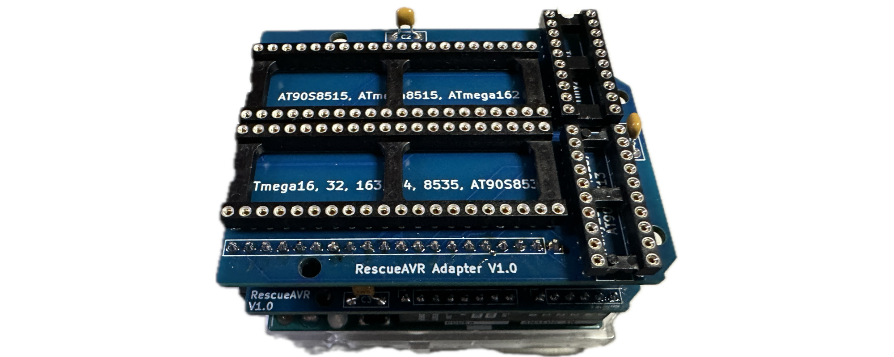

# RescueAVR Assembly

The basic kit and the full kit kit [can be bought at Tindie](https://www.tindie.com/products/fogg/rescueavr-hv-fuse-programmer-for-avrs/).

The basic kit consists of:

- one RescueAVR PCB
- one RescueAVR Adapter PCB
- one GTIWUNG Step-Up Converter (5V/12V)
- four soldering pins (to connect the step-up converter to the RescueAVR PCB)

The full kit contains in addition:

- one 8-pin IC socket
- one 14-pin IC socket
- one 28-pin (narrow) IC socket
- two 20-pin IC sockets
- two 40-pin IC sockets
- two 40-pin pin headers (to be broken up into one 6-pin, three 8-pin, one 10-pin, and one 20-pin header)
- one 8-pin pin socket
- one 20-pin socket
- five 100 nF capacitors
- five resistors (100 Ω, two 1 kΩ, 4.7 kΩ, 10 kΩ)
- one NPN transistor (BC547)
- one PNP transistor (BC557)

### Step 1: Install step-up converter

If the step-up converter is not already installed on the RescueAVR PCB, this is the first step. 

1. Insert the four soldering pins with the shorter side into the PCB.
2. Make sure the pins are straight and that the tip protrudes on the backside.
3. Place the step-up converter with the component side upwards on the pins.
4. Solder the pins to the step-up converter.
5. Solder the pins on the backside of the PCB.

### Step 2: Solder resistors

Solder the five resistors:

1. R1: 4.7 kΩ (yellow-violet-red)
2. R2: 1 kΩ (brown-black-red)
3. R3: 1 kΩ (brown-black-red)
4. R4: 10 kΩ (brown-black-orange)
5. R5: 100 Ω (brown-black-brown)

### Step 3: Solder capacitors and transistors

1. Q1: BC547 (NPN)
2. Q2: BC557 (PNP)
3. C1-C3: 100 nF

### Step 4: Solder Arduino pin headers

Soldering the Arduino pin headers is preferrably done by placing the pin headers into the the pin sockets of an UNO and then placing the RescueAVR PCB on top of it. This way, you make sure that the pin headers are perfectly aligned.

### Step 5: Solder IC sockets

Insert the 8-pin, 14-pin, and 28-pin sockets into the PCB and solder them. Make sure to align the notches with the notches on the silkscreen. 

### Step 6: Solder the pin sockets and the pin headers for the adapters

In order to ensure alignment, put the pinheaders into the sockets, put the socketes into the RescueAVR PCB and then put the adpater PCB on top. Now solder the pin sockets and headers. 

### Step 7: Solder IC sockets and capacitors to adapter

While soldering the two 40-pin and 20-pin sockets, ensure the notches align. 

